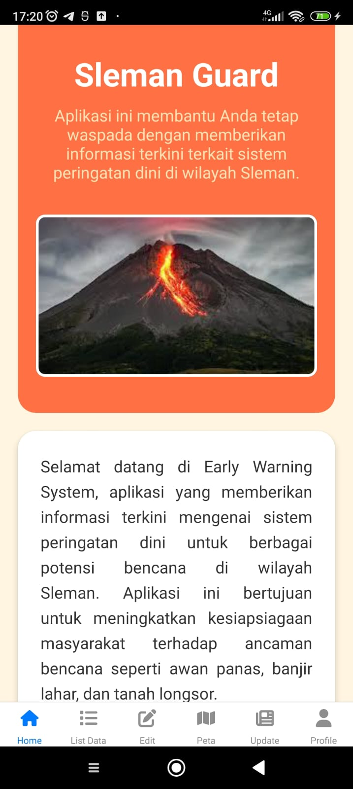
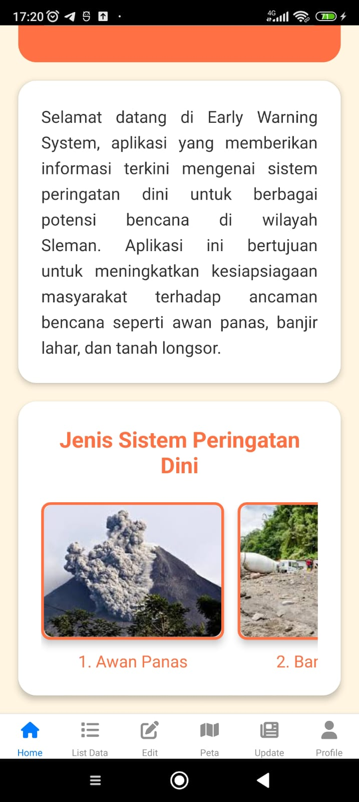
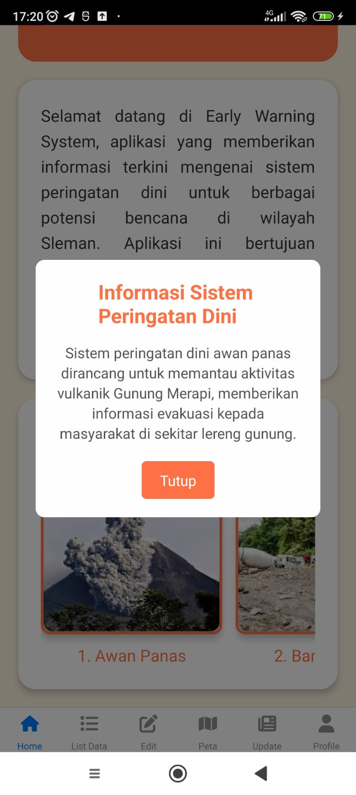
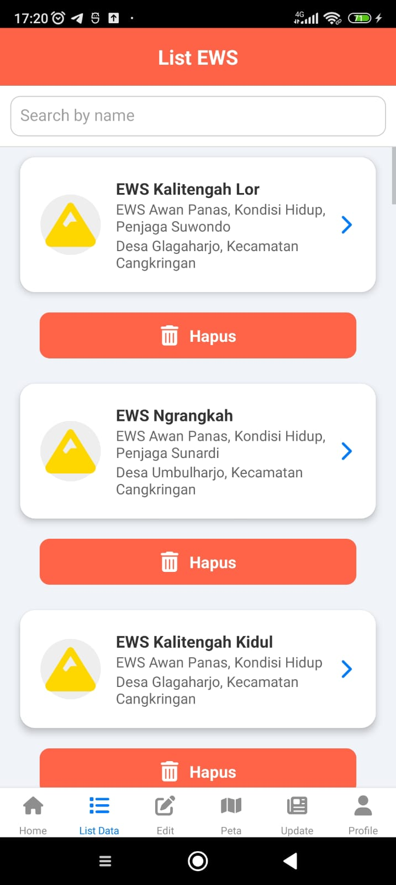
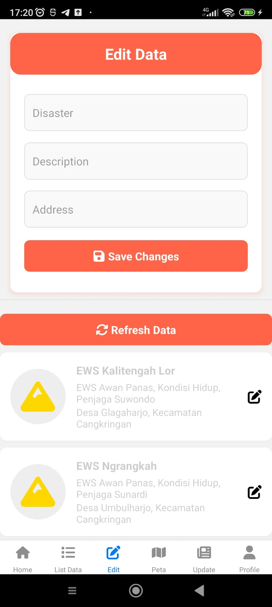
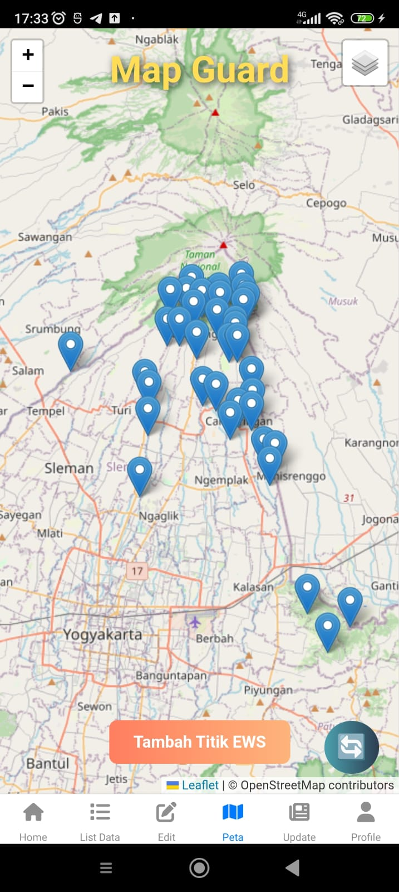
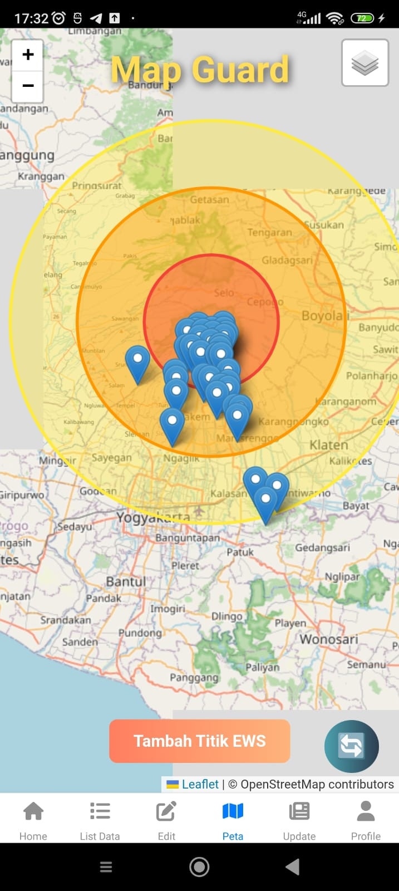
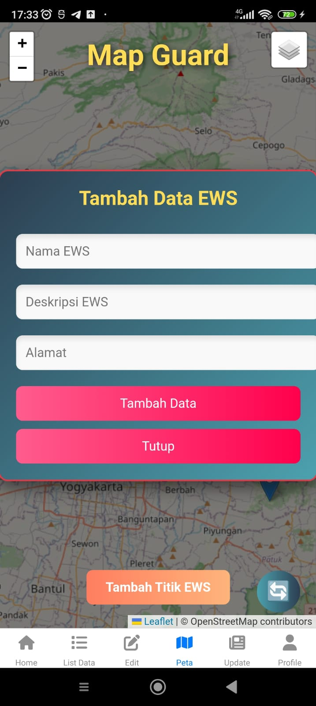
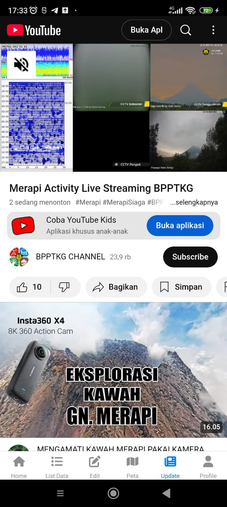
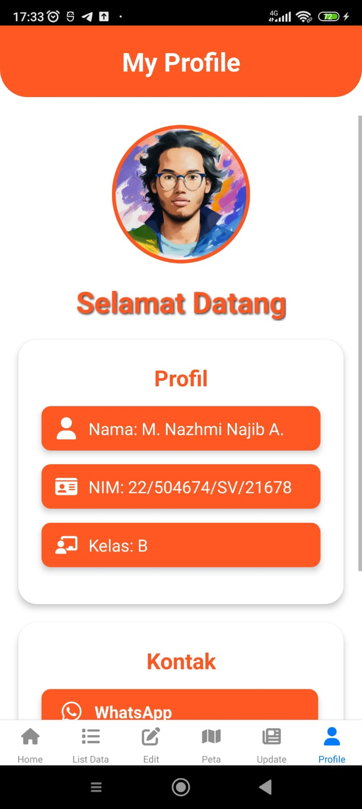

# *🌍 SLEMAN GUARD*

Sleman Guard adalah aplikasi peta interaktif berbasis web yang dirancang untuk membantu pengelolaan dan pemantauan titik Early Warning System (EWS) di kawasan rawan bencana. Aplikasi ini memungkinkan pengguna untuk menambahkan, melihat, dan mengelola data titik EWS beserta deskripsinya secara real-time dengan antarmuka yang menarik dan mudah digunakan.

# *✨ Fitur Utama:*

🗺️ Pemetaan zona risiko bencana berdasarkan radius dari pusat erupsi Gunung Merapi.

➕ Penambahan titik data EWS melalui antarmuka pengguna yang interaktif.

📊 Pengelolaan data EWS menggunakan API untuk penyimpanan dan pemanggilan data.

# *🛠️ Komponen Pembangun Produk*

### **1. Antarmuka Pengguna (Frontend)**

- HTML, CSS, JavaScript: Dasar untuk membangun antarmuka pengguna.
- React Native: Untuk pengembangan aplikasi mobile multiplatform (iOS dan Android).
- React Navigation: Untuk mengatur navigasi antar layar pada aplikasi mobile

### **2. Library dan Framework**

- Leaflet.js: Library JavaScript untuk peta interaktif.
- Fetch API: Untuk komunikasi antara frontend dan backend.
- Google Maps API: Untuk membuka titik EWS di google maps.

### **3. Backend**

- JSON Server: Sebagai basis data lokal berbasis file JSON untuk menyediakan data API REST dengan cepat.
  - **POST**: Menambahkan data EWS.
  - **GET**: Mengambil data EWS yang ada.
  - **Patch**: Mengubah sebagian data EWS berdasarkan ID.
  - **Delete**: Menghapus data EWS berdasarkan ID.

### **4. Sumber Data**

- Data Awal Zona Bahaya: Didefinisikan secara manual berdasarkan radius zona bahaya dari Gunung Merapi.
- Data Titik EWS: Website mitigasi BPBD Sleman.

# *🖼️ Tangkapan Layar Komponen Penting Produk* #

### **1. Home**

🏠 Halaman utama untuk menyambut pengguna dan memberikan informasi umum mengenai sistem EWS (Early Warning System).

### **2. List Data**

📋 Menampilkan daftar data EWS yang telah tersimpan, termasuk lokasi, status, dan tindakan yang dapat diambil, seperti menghapus data.

### **3. Edit Data**

✏️ Menyediakan formulir untuk mengedit data EWS yang sudah ada, termasuk perubahan lokasi, status, dan parameter lainnya.

### **4. Map**

🗺️ Menampilkan peta interaktif dengan zona bahaya yang memiliki radius berbeda, serta marker yang menunjukkan informasi terkait EWS.

### **5. Update**

🔄 Formulir menampilkan aktifitas Merapi secara live.

### **6. Profile**

👤 Halaman untuk melihat informasi profil, termasuk nama, NIM, dan pengaturan lainnya.

